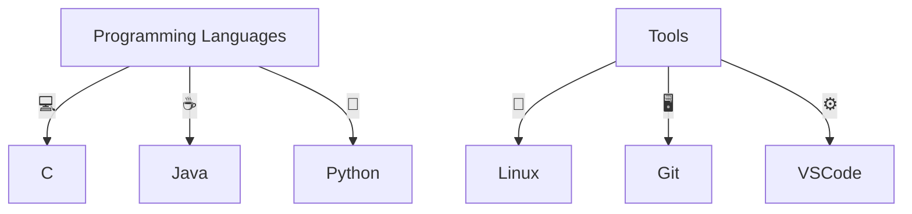

# 👋 Hi, I'm Kevin Canto

> 🚀 Software Engineer & Continuous Learner | Passionate about building effective solutions and growing every day.

---

## 🧑‍💻 **About Me**
- 🎸 Guitarist | 🧩 Puzzle Solver | 🏀 Basketball Fan
- 💻 Currently exploring **Python**, **C**, and **Java**
- 📚 Always learning something new!

---

## 📊 **Skills & Tools**

---

## 📈 **Projects**

| Project                | Description                                                                                                               | Tech Stack           | Status      |
|------------------------|---------------------------------------------------------------------------------------------------------------------------|----------------------|-------------|
| **SmartMeal**          | Python-based AI for meal planning & finance management, tailored to budget constraints.                                   | Python, AI           | 🛠️ In Progress |
| **Custom Package Installer** | C terminal tool for installing & managing packages, with custom commands for remote archives (like `winget`, but custom). | C, Linux, Shell      | 🛠️ In Progress |

---

## 📝 **Contact**

- [LinkedIn](https://www.linkedin.com/in/kevincanto)  
- 📫 *Feel free to reach out for collaboration or just to say hi!*

---

> “Code is like humor. When you have to explain it, it’s bad.” – Cory House

